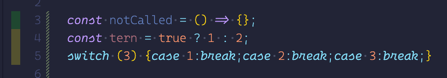
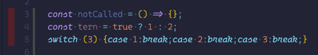

# @appbot.co/uncover

[](https://codeclimate.com/repos/6400001854e316009d001dd2/maintainability) [](https://codeclimate.com/repos/6400001854e316009d001dd2/test_coverage)

  

Several code quality tools can only handle line coverage, but that doesn't help when your production code is failing with missed branches, or uncovered methods.

This tool allow you to take your valid LCOV files, with the useful branch and function coverage, and modify the line coverage to reflect those misses.

## Usage

For a single coverage file

```bash
uncover coverage/lcov.info > coverage/lcov.uncovered.info
# For your coverage provider, you may then need to rename it back to find it
mv coverage/lcov.uncovered.info coverage/lcov.info
# send to your coverage provider. eg.
# ./cc-test-reporter after-build -t lcov -p "./"
```

If your coverage is produced from multiple test runs

```bash
# store each runs coverage with unique ids
UUID=$(cat /proc/sys/kernel/random/uuid)
mv lcov.info lcov.$UUID.info

# once all the runs are complete, merge and uncover
uncover coverage/lcov.*.info > coverage/lcov.info
# you can now send to your coverage provider as though it was a single run. eg.
# ./cc-test-reporter after-build -t lcov -p "./"
```

### 📔 Notes

**For Ruby:** You will need to use the [umbrellio fork with the method coverage branch](https://github.com/umbrellio/simplecov/tree/add-method-coverage-support) to get method coverage until [PR#987](https://github.com/simplecov-ruby/simplecov/pull/987) is merged.<br>
**For Javascript:** `c8` dose not currently produce correct branch and function coverage. Stick with [nyc](https://istanbul.js.org/) for now.

## Uncovering

```javascript
// javascript
if (something) {
  newThing = new Thing();
}
```

```ruby
# ruby
newThing = Thing.new if something
```

Testing each of these with `something` set will show positive line coverage, and checking coverage locally would likely show the missing (branch) coverage from where it was non-truthy, but your online tool may not show that. For a PR with anything substantial going on, it's easy to miss a non-present test covering non-present code. Well, you won't any more. In fact, you may be triggered to look even harder, because now some code that seems obviously covered, will show no coverage at all.

```javascript
# javascript
const meth = () => 'call me'
```

```ruby
# ruby 3.1
def meth = 'call me'
```

These too would show positive line coverage, even when the method was never called. These are rectified by clearing the coverage for the line on which they were defined.

Here are before and after shots showing the coverage in the gutter on VSCode. Branch coverage can be seen in the before shot, but this will show as fully covered in some tools, as the method coverage is here.

 

As an example of the lies that line coverage provides. When we enabled this tool at [Appbot](https://appbot.co) our coverage on Code Climate dropped by about 4%. Now excuse me while I go squash some potential bugs 🐛.

## Merging

If you pass in multiple lcov files `uncover` will merge them ... properly. All the coverage elements get summed before uncover does its real work.

### example:

`uncover lcov.run1.info lcov.run2.info > lcov.info`

<table>
<tr>
<td>run 1</td>
<td>run 2</td>
<td>merged</td>
<td>uncovered</td>
</tr>
<tr>
<td>
<pre>
SF:lib/file.js
FN:4,addIf
<span style="color:red">FNDA:0,addIf</span>
FNF:1
FNH:0
<span style="color:red">BRDA:5,0,0,0</span>
BRDA:5,0,1,1
BRF:2
BRH:1
DA:1,1
DA:5,2
DA:7,2
LF:3
LH:3
end_of_record
</pre>
</td>
<td>
<pre>
SF:lib/file.js
FN:4,addIf
FNDA:3,addIf
FNF:1
FNH:1
<span style="color:red">BRDA:5,0,0,0</span>
BRDA:5,0,1,3
BRF:2
BRH:1
DA:1,1
DA:5,3
<span style="color:red">DA:7,0</span>
LF:3
LH:3
end_of_record
</pre></td>
<td>
<pre>SF:lib/file.js
FN:4,addIf
<span style="color:green">FNDA:3,addIf</span>
FNF:1
FNH:1
<span style="color:red">BRDA:5,0,0,0</span>
BRDA:5,0,1,4
BRF:2
BRH:1
DA:1,2
DA:5,5
<span style="color:green">DA:7,2</span>
LF:3
LH:3
end_of_record
</pre></td>
<td>
<pre>
SF:lib/file.js
FN:4,addIf
FNDA:3,addIf
FNF:1
FNH:1
<span style="color:red">BRDA:5,0,0,0</span>
BRDA:5,0,1,4
BRF:2
BRH:1
DA:1,1
<span style="color:red">DA:5,0</span>
DA:7,2
LF:3
LH:3
end_of_record
</pre></td>
</tr>
</table>
